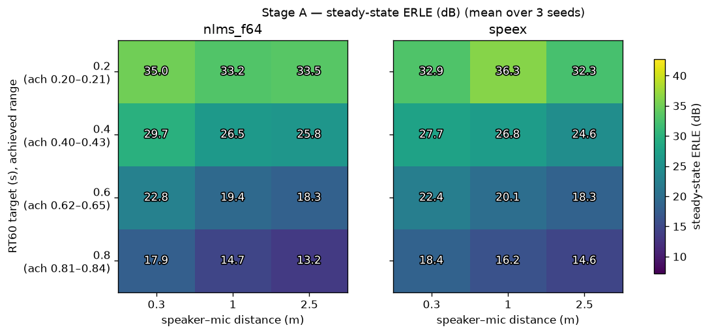
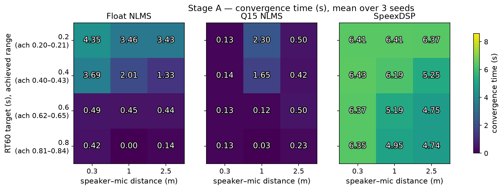
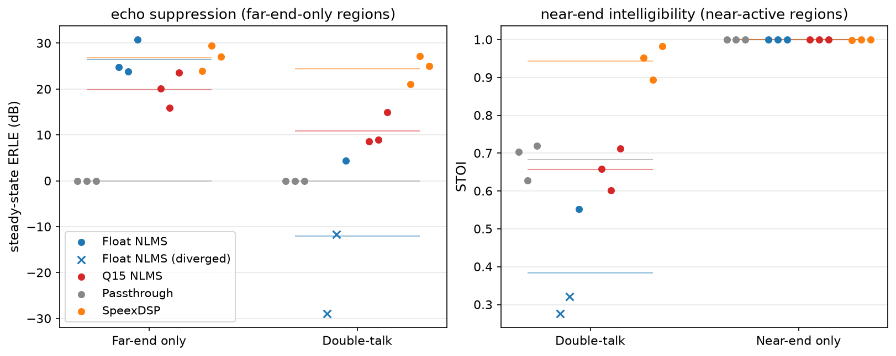
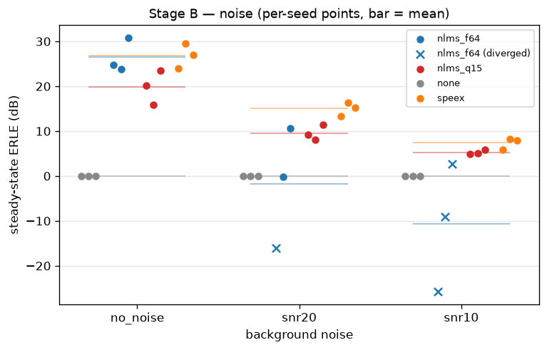
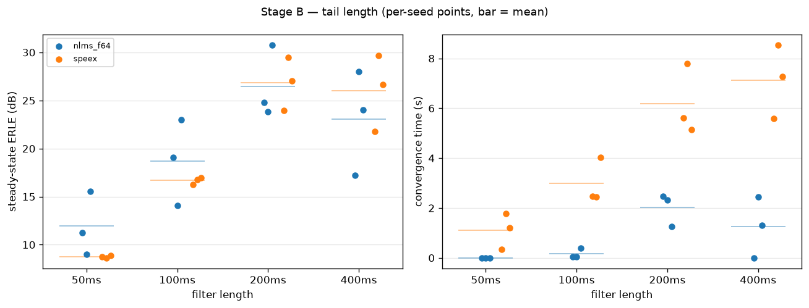
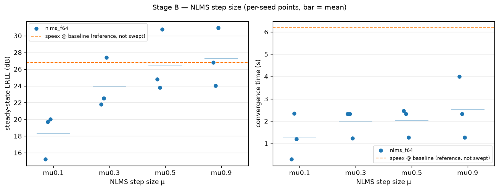
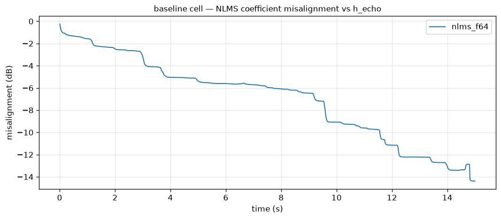
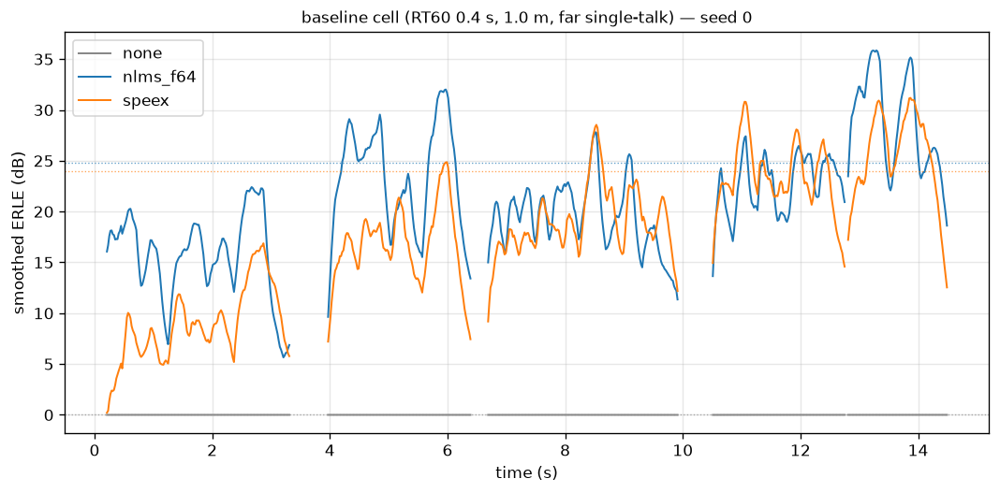

# AEC benchmark — Tier 0 report

Comparison of a float64 NLMS adaptive filter (`nlms_f64`) and the SpeexDSP
MDF echo canceller (`speex`) against a passthrough reference (`none`) on
synthesised room-acoustic scenarios. 201 runs
(3 utterance-pair seeds per condition); 195 completed normally,
6 diverged (all unprotected-NLMS runs; §2.4). All numbers in
this report are rendered from `results/raw/*.csv` by
`scripts/render_report.py`; run provenance (git SHA per row):
a1289ff-dirty.

## 1. Method

### 1.1 Signal synthesis

Speech is drawn from LibriSpeech test-clean at 16000 Hz.
Each seed uses a disjoint (far-end, near-end) speaker pair — all
6 speakers distinct — drawn reproducibly from a fixed selection
seed; per-speaker utterances are concatenated in a seeded order to fill the
15 s scenario duration. The same three pairs are reused
across every scenario, so factor effects are paired rather than confounded
with material changes. The far-end signal `x` is convolved with the
loudspeaker-to-mic RIR to form the echo; near-end speech is convolved with
its own RIR; noise (when present) is white noise filtered to the long-term
average spectrum of the run's speech material; the microphone signal is the
sum. The AEC receives `x` and `d` only.

Levels: speech material is normalised to
-26 dBov active-speech level using an
energy-gated RMS — frames more than
40 dB below the peak frame RMS are
treated as inactive. This is a simplified active-level measure, not ITU-T
P.56. The near-end level is then pinned to a configured
signal-to-echo ratio (SER 0 dB,
near-end over echo, measured on the double-talk overlap), so the
fixed-point operating point is controlled rather than an accident of room
geometry.

The double-talk timeline is far-only lead-in (0–4 s),
double-talk (4–11 s), then a far-only
tail to 15 s — the tail exists so that steady-state
statistics are measured after, not before, the double-talk episode.

### 1.2 Room simulation and RT60 calibration

Rooms are 5 × 4 ×
3 m pyroomacoustics ShoeBoxes (image source
method). The microphone sits off-centre; sources are placed off-axis and
away from half-dimension coordinates to avoid degenerate image-source
symmetry, with ≥0.5 m wall clearance
(asserted). The propagation delay is left in the RIRs; a build-time
assertion fails if the first arrival is earlier than pure propagation
allows.

`inverse_sabine` is used only to **initialise** the wall absorption; the
value actually used is calibrated by bisection until the RT60 measured on
the generated loudspeaker-to-mic RIR (Schroeder backward integration) is
within ±3% of target at the
1 m reference distance. The
uncalibrated Sabine values overshoot systematically, and the overshoot
grows with target RT60 — a small finding in itself:

| target (s) | Sabine α | achieved w/ Sabine α (s) | calibrated α | achieved w/ calibrated α (s) |
|---|---|---|---|---|
| 0.2 | 0.514 | 0.187 | 0.493 | 0.200 |
| 0.4 | 0.257 | 0.464 | 0.289 | 0.401 |
| 0.6 | 0.171 | 0.749 | 0.204 | 0.615 |
| 0.8 | 0.129 | 1.034 | 0.161 | 0.811 |

The calibrated absorption for each RT60 level is shared across all
distance levels of that row (per-distance recalibration would confound the
distance axis with wall absorption). Residual drift remains at 2.5 m,
where every level measures ~5–8% above target: the weaker direct path
shifts the Schroeder fit toward the reverberant tail. Stage A figures and
tables are therefore labelled with **achieved** RT60, and per-scenario
achieved values are stored in every CSV row.

### 1.3 Systems under test

| ID | Description |
|---|---|
| `none` | Passthrough reference. Not a no-op: `d` goes through the identical float→int16→float round-trip at the identical scaling constant as `speex`, so the 0 dB reference is measured on the same signal path and carries the same quantisation floor. |
| `nlms_f64` | Sample-wise float64 NLMS, L = 200 ms (3200 taps), μ = 0.5, δ = 1e-06. **No double-talk detection, deliberately** — its absence is what makes SpeexDSP's built-in protection visible. Verified sample-exact against a naive per-sample reference. |
| `speex` | SpeexDSP MDF, frame size 160 samples, tail 200 ms, sampling rate set explicitly via `speex_echo_ctl` and read back (asserted). |

One float→int16 scaling constant per run, computed to leave
6 dB headroom above max(|x|, |d|), applied
identically to every system in the run, asserted not to clip on `x` and
`d`, with `speex` output checked for saturation. The constant is recorded
in every CSV row.

`nlms_f64` runs in float throughout — it never passes through the int16
path. The float-vs-fixed comparison is therefore asymmetric by
construction: NLMS is exempt from the quantisation floor the fixed-point
systems carry. This is stated here as a caveat and revisited in §4.

Speex is tested **as a linear echo canceller only**: the
`speex_preprocess` chain (residual echo suppressor, noise suppressor) is
never attached. Attaching it would confound the comparison against a bare
adaptive filter — the preprocessor's nonlinear suppression would mask the
linear canceller's actual behaviour. Comparisons against deployed Speex
configurations (which typically include the preprocessor) should keep this
in mind.

### 1.4 Metrics

**Segmentation.** Metrics are computed over a three-state activity
segmentation (far-active / near-active / neither) derived from the
ground-truth component signals independently, never from the mixture:
20 ms frames, a frame is active when its mean power
exceeds -45 dBov, and activity is held
for 200 ms after the last active frame to bridge
inter-word pauses.

**ERLE** (primary): short-time, per 20 ms frame, computed **only over
ERLE-valid frames** (far-active and not near-active — during double-talk
the error signal legitimately contains near-end speech), smoothed with an
EMA (α = 0.9 over the valid-frame sequence).
Steady state is the median of the final
30% of valid smoothed frames. A
sanity assertion fails any run whose **steady-state** ERLE exceeds
60 dB — the signature of passing the echo
itself as the reference; it applies to the steady-state statistic only,
since instantaneous short-time ERLE legitimately spikes in low-energy
frames.

**Convergence time**: time from the first valid frame until smoothed ERLE
first reaches 90% of that run's steady
state; NaN (flagged non-converged) if never reached. One caveat deserves
its own paragraph. Because the threshold is relative to **each run's own
steady state**, the metric reads *fast* when the target is weak and *slow*
when adaptation is gradual. In Stage A, NLMS at high RT60 appears to
converge in under half a second — not because adaptation is faster there,
but because its steady state is low and 90% of a weak target is reached
almost immediately. Conversely, Speex's ~5–6 s figures partly reflect its
slowly rising curve shape rather than a 5 s wait for usable cancellation.
Cross-system convergence comparisons are only valid between runs with
comparable steady states.

**Near-end distortion**: segmental SNR of the output against `s` — the
reverberant near-end at the microphone, **not** `s_clean` — because the
AEC is not being asked to dereverberate. Computed over double-talk frames
(or, for near-single-talk, over near-active frames, where it degenerates
to passthrough distortion). Frames with bit-exact reproduction are
excluded and counted; a run reproducing every frame exactly reports +inf
rather than a floor-dependent large number. STOI and wideband PESQ are
computed over the near-active span; log-spectral distance per frame.

**Misalignment**: 10·log10(‖w − h‖²/‖h‖²) with `h_echo`
truncated/zero-padded to the filter length. Computed for `nlms_f64` (Speex
does not expose coefficients).

**Divergence**: an output is flagged diverged at the first sample that is
non-finite or exceeds 10× the peak of |d| (+20 dB); the onset time is
recorded as a data point. Divergence is detected, never prevented.

### 1.5 Experiment matrix

Stage A crosses RT60 × speaker–mic distance (far single-talk, no noise);
Stage B varies one factor at a time around the baseline (RT60 0.4 s,
1.0 m): talk state, background noise, tail length (both systems), and NLMS
step size (with Speex run once at baseline as a labelled reference — it
has no step-size parameter). 201 rows; the sum of per-row processing
times is 1.8 min.

## 2. Results

### 2.1 Stage A — RT60 × distance

Steady-state ERLE (dB), mean over 3 seeds:

**nlms_f64**

| RT60 target (s) | 0.3 m | 1 m | 2.5 m |
|---|---|---|---|
| 0.2 (ach. 0.20–0.21) | 35.0 | 33.2 | 33.5 |
| 0.4 (ach. 0.40–0.43) | 29.7 | 26.5 | 25.8 |
| 0.6 (ach. 0.62–0.65) | 22.8 | 19.4 | 18.3 |
| 0.8 (ach. 0.81–0.84) | 17.9 | 14.7 | 13.2 |

**speex**

| RT60 target (s) | 0.3 m | 1 m | 2.5 m |
|---|---|---|---|
| 0.2 (ach. 0.20–0.21) | 32.9 | 36.3 | 32.3 |
| 0.4 (ach. 0.40–0.43) | 27.7 | 26.8 | 24.6 |
| 0.6 (ach. 0.62–0.65) | 22.4 | 20.1 | 18.3 |
| 0.8 (ach. 0.81–0.84) | 18.4 | 16.2 | 14.6 |

Convergence time (s) — read §1.4's caveat before comparing across systems:

**nlms_f64**

| RT60 target (s) | 0.3 m | 1 m | 2.5 m |
|---|---|---|---|
| 0.2 (ach. 0.20–0.21) | 4.35 | 3.46 | 3.43 |
| 0.4 (ach. 0.40–0.43) | 3.69 | 2.01 | 1.33 |
| 0.6 (ach. 0.62–0.65) | 0.49 | 0.45 | 0.44 |
| 0.8 (ach. 0.81–0.84) | 0.42 | 0.00 | 0.14 |

**speex**

| RT60 target (s) | 0.3 m | 1 m | 2.5 m |
|---|---|---|---|
| 0.2 (ach. 0.20–0.21) | 6.41 | 6.41 | 6.37 |
| 0.4 (ach. 0.40–0.43) | 6.43 | 6.19 | 5.25 |
| 0.6 (ach. 0.62–0.65) | 6.37 | 5.19 | 4.75 |
| 0.8 (ach. 0.81–0.84) | 6.35 | 4.95 | 4.74 |




ERLE degrades monotonically with RT60 for both systems at every distance —
at 1.0 m, NLMS falls from 33.2
to 14.7 dB and
Speex from 36.3 to
16.2 dB across the
four levels. The per-step drop is roughly constant (~5–7 dB per 0.2 s of
RT60) rather than accelerating at the longest tail. Distance is likewise
monotonic (closer loudspeaker → higher ERLE) with one off-pattern cell
(Speex at RT60 0.2, which peaks at 1.0 m).

### 2.2 Talk state

Steady-state ERLE (dB) over far-only regions ("–" = undefined, no
far-end activity):

| talk state | nlms_f64 | none | speex |
|---|---|---|---|
| far_single | 26.5 | -0.0 | 26.8 |
| double | -12.1 | -0.0 | 24.4 |
| near_single | – | – | – |

Near-end distortion over near-active regions:

**double-talk** (echo + near-end simultaneously):

| metric | nlms_f64 | none | speex |
|---|---|---|---|
| pesq_wb | 1.07 | 1.19 | 2.76 |
| segsnr_db | -19.55 | -0.93 | 5.55 |
| stoi | 0.38 | 0.68 | 0.94 |

**near-single-talk** (no far-end at all — pure passthrough):

| metric | nlms_f64 | none | speex |
|---|---|---|---|
| pesq_wb | 4.64 | 4.64 | 4.54 |
| segsnr_db | inf | 68.08 | 8.72 |
| stoi | 1.00 | 1.00 | 1.00 |

The `none` row's near-single segmental SNR (68.1 dB) is the
measured int16 quantisation floor of the shared I/O path — the ceiling
against which the other systems' segSNR should be read. `nlms_f64` reports
+inf there because with a silent reference its float output reproduces `d`
bit-exactly. Speex's much lower value is discussed in §4.

During double-talk, Speex holds 24.4 dB
ERLE (vs 26.8 dB in far single-talk)
while *improving* the near-end over the unprocessed mixture: segSNR
+5.6 dB vs
-0.9 dB, STOI
0.94 vs
0.68, PESQ
2.76 vs
1.19. The unprotected NLMS instead
destroys both: -12.1 dB mean ERLE and
-19.6 dB segSNR (per-seed detail in
§2.4).



### 2.3 Background noise

Steady-state ERLE (dB), mean over seeds (diverged runs included — they are
the phenomenon, not an artifact):

| noise level | nlms_f64 | none | speex |
|---|---|---|---|
| no_noise | 26.5 | -0.0 | 26.8 |
| snr20 | -1.8 | -0.0 | 15.0 |
| snr10 | -10.7 | -0.0 | 7.4 |

Speex degrades gracefully as SNR falls. NLMS collapses: at 20 dB SNR
1 of 3 seeds diverged; at 10 dB SNR 3 of
3 did. No near-end speech is present in any of these runs.



### 2.4 Divergence onsets

Every non-ok run in the matrix, all `nlms_f64`:

| run | onset (s) | onset into double-talk (s) | post-hoc steady ERLE (dB) |
|---|---|---|---|
| b.talk.double.s0.nlms_f64 | 6.71 | 2.71 | -28.98 |
| b.talk.double.s1.nlms_f64 | 7.05 | 3.05 | -11.65 |
| b.noise.snr20.s0.nlms_f64 | 6.92 | – | -16.04 |
| b.noise.snr10.s0.nlms_f64 | 4.12 | – | -25.72 |
| b.noise.snr10.s1.nlms_f64 | 0.43 | – | -9.09 |
| b.noise.snr10.s2.nlms_f64 | 1.36 | – | 2.76 |

Per-seed detail for double-talk (seed 0: diverged at 6.71 s, post-hoc steady ERLE -29.0 dB, seed 1: diverged at 7.05 s, post-hoc steady ERLE -11.7 dB, seed 2: no divergence, post-hoc steady ERLE +4.4 dB) shows the
divergences beginning 2.7–3.1 s after double-talk onset — and that one
seed survives outright. Under 10 dB noise, divergence arrives within
0.4–4.1 s
of signal onset, before any adaptation has consolidated.

### 2.5 Tail length

Steady-state ERLE (dB):

| filter length | nlms_f64 | speex |
|---|---|---|
| 50ms | 11.9 | 8.7 |
| 100ms | 18.7 | 16.7 |
| 200ms | 26.5 | 26.8 |
| 400ms | 23.1 | 26.0 |

Convergence time (s):

| filter length | nlms_f64 | speex |
|---|---|---|
| 50ms | 0.0 | 1.1 |
| 100ms | 0.2 | 3.0 |
| 200ms | 2.0 | 6.2 |
| 400ms | 1.2 | 7.1 |

Both systems lose heavily from undermodelling (50 ms covers little of a
0.4 s decay). NLMS peaks at 200 ms and *loses* ground at 400 ms —
the longer filter adds gradient noise and adapts more slowly per tap —
while Speex holds its 200 ms performance at 400 ms.



### 2.6 NLMS step size

Mean over seeds; Speex at its baseline configuration shown for reference
(it has no step-size parameter and is not part of the sweep):

| level | steady ERLE (dB) | convergence (s) | final misalignment (dB) |
|---|---|---|---|
| mu0.1 | 18.32 | 1.28 | -5.74 |
| mu0.3 | 23.89 | 1.96 | -12.28 |
| mu0.5 | 26.47 | 2.01 | -17.08 |
| mu0.9 | 27.26 | 2.53 | -18.51 |

| reference | steady ERLE (dB) | convergence (s) |
|---|---|---|
| speex @ baseline | 26.82 | 6.19 |



## 3. Discussion

### 3.1 The hazard is uncorrelated energy, not double-talk specifically

The classic framing says an unprotected adaptive filter is endangered by
double-talk. The data here support a broader statement: the hazard is
**any energy in `d` uncorrelated with the reference `x`** — near-end
speech is one instance, background noise another. The noise axis is the
cleaner demonstration: with no near-end speech whatsoever, stationary
noise at 20 dB SNR diverged 1/3 seeds and 10 dB SNR
diverged 3/3, dose-dependent, with onsets as early as
0.43 s. The mechanism
is the NLMS update itself: during far-end pauses the sliding ‖x‖²
collapses toward the regulariser δ = 1e-06 while the error
still carries noise, so the normalised step explodes. Double-talk is the
dramatic case of the same mechanism (near-end energy during low reference
power), not a separate phenomenon. Speex, whose MDF carries adaptation
control designed for exactly this, degrades smoothly on both axes
(§2.2–2.3).

### 3.2 The step-size trade-off only exists under interference

In clean far single-talk, the textbook μ trade-off is absent: ERLE and
final misalignment both improve monotonically up to μ = 0.9
(§2.6 — 27.3 dB /
-18.5 dB). There is nothing
to trade against — no noise, no near end, and a 15 s horizon that rewards
fast adaptation. The cost of large μ only materialises when interference
exists: the noise and double-talk axes show μ = 0.5 diverging outright.
Read together, the two axes say that step-size tuning on clean data
mislearns the operating point for realistic conditions.

### 3.3 Output quietness overstates estimate quality

At baseline, NLMS reaches 26.5 dB mean steady-state
ERLE while its final coefficient misalignment is only
-17.1 dB — the output is quiet out of proportion to the
accuracy of the underlying echo-path estimate. ERLE rewards cancelling
whatever the *current* input excites; misalignment measures the whole
estimate. The gap is visible dynamically too: the misalignment trajectory
(figure below) improves stepwise as new speech material excites new parts
of the path, and the ERLE curve's oscillation with the speech envelope is
the same effect seen from the output side.



### 3.4 Two convergence styles — and a metric artifact

NLMS converges fast and raggedly (baseline
2.01 s mean); Speex ramps slowly and
smoothly (6.19 s). But §1.4's caveat
applies: part of the Stage A convergence table is the metric's
construction, not adaptation speed. NLMS's sub-second "convergence" at
RT60 0.8 s is 90% of a weak target; Speex's ~6 s figures are the price of
a curve that keeps rising toward a slightly higher plateau. The honest
summary is a difference in *style* — fast/oscillatory vs slow/monotonic —
with scalar convergence times only comparable at similar steady states.



### 3.5 Three seeds, visible individually

The double-talk row is the argument for per-seed points: of three seeds
under identical conditions, two diverged (2.7 and 3.1 s into double-talk)
and one survived with degraded but positive ERLE (§2.4). A mean over
those three (−12 dB) describes none of them. All Stage B figures
therefore show individual seeds, with diverged runs marked; with
3 seeds, error bars would imply a precision this design does not
have.

## 4. Limitations

- **Simulation gap.** No loudspeaker nonlinearity, no time-varying echo
  paths, no microphone self-noise. All rooms are ideal shoeboxes with
  frequency-flat absorption. Every system here solves a purely linear,
  time-invariant problem; real-world rankings may differ, particularly
  for Speex whose design anticipates nonlinear residuals.
- **segSNR punishes the perceptually irrelevant.** In near-single-talk,
  Speex scores 8.7 dB segSNR against
  the `none` floor of 68.1 dB — yet its STOI is
  1.00 and PESQ
  4.54. The alteration is concentrated at
  low frequency, consistent with SpeexDSP's internal DC-notch filter on
  the microphone path: a waveform-difference metric punishes a
  perceptually irrelevant low-frequency change that the perceptual
  metrics correctly ignore. This mismatch is part of the motivation for
  the planned masking-based audibility analysis (Tier 1).
- **Float-vs-fixed asymmetry.** `nlms_f64` never passes the int16 path;
  `speex` and `none` do. The quantisation floor measured on `none`
  (§2.2) bounds the effect, but the comparison is not symmetric.
- **Convergence metric construction.** Relative-to-own-steady-state
  convergence times are not comparable across systems with different
  steady states (§1.4, §3.4).
- **Three seeds.** Enough to expose seed-dependence (§3.5), not enough
  for distributional claims. Per-seed values are plotted and stored.
- **Segmental SNR reference choice.** Distortion is referenced to the
  reverberant near-end `s`; systems are not rewarded or punished for
  dereverberation effects.

## 5. Reproduction

From a clean checkout (macOS/Linux, Python 3.11, SpeexDSP installed —
`brew install speexdsp` or `apt install libspeexdsp-dev`):

```
python3.11 -m venv .venv
source .venv/bin/activate
pip install -r requirements.txt
python scripts/fetch_data.py          # LibriSpeech test-clean (~346 MB, md5-checked)
python -m pytest tests/               # unit + integration tests
python src/run_experiment.py --batch  # full matrix -> results/raw/runs.csv (+ calibration.csv)
python scripts/make_figures.py        # all figures  -> results/figures/
python scripts/render_report.py       # this report  -> results/report.md
```

The batch is deterministic: re-running it reproduces every metric column
bit-identically (verified). RT60 absorption calibration runs once and is
cached under `data/generated/`; a cold run recalibrates automatically
(a few extra minutes). Single cells can be re-run for debugging with
`python src/run_experiment.py --scenario baseline --seed 0`.
