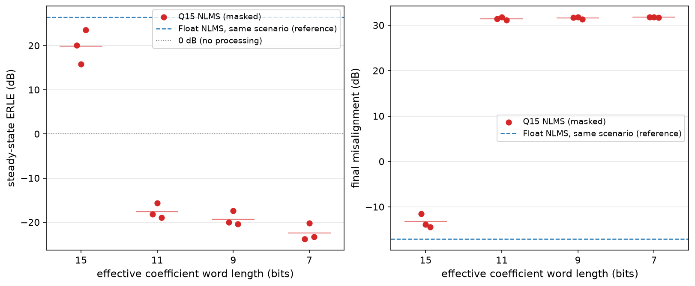
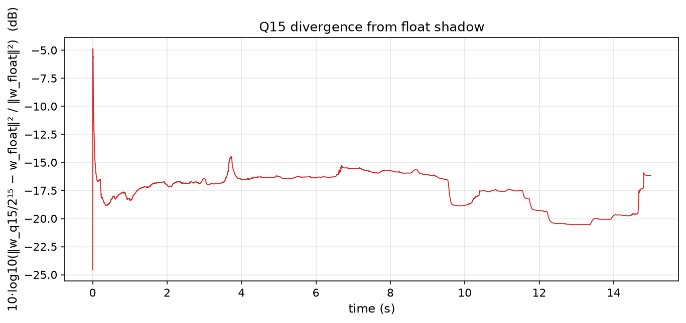
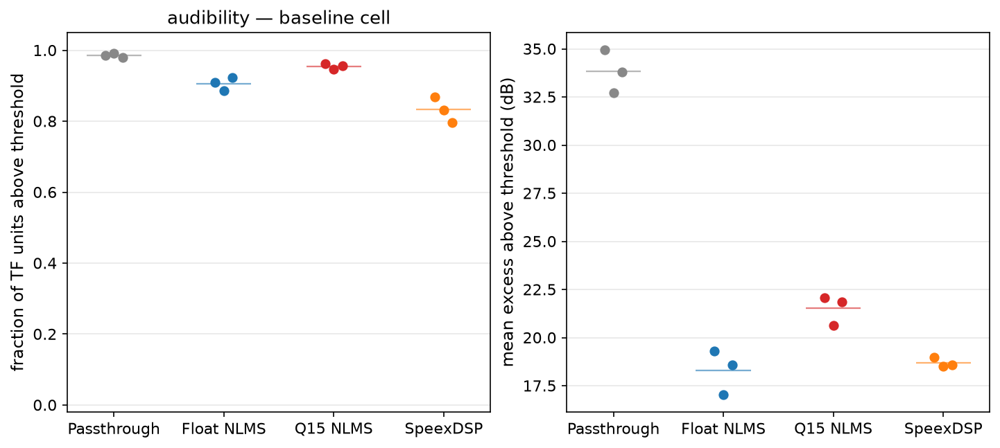

# AEC benchmark — report

Comparison of a float64 NLMS adaptive filter (`nlms_f64`), a Q15
fixed-point NLMS (`nlms_q15`), and the SpeexDSP MDF echo canceller
(`speex`) against a passthrough reference (`none`) on synthesised
room-acoustic scenarios. 279 runs (3 utterance-pair seeds
per condition); 273 completed normally, 6 diverged
(all `nlms_f64`; §2.4 — the fixed-point system cannot trip the divergence
detector at all, see §2.8). All numbers in this report are rendered
from `results/raw/*.csv` by `scripts/render_report.py`; provenance is
recorded per run (§5).

## Summary

1. At the clean baseline the Float NLMS and SpeexDSP reach comparable
   steady-state ERLE (26.5 vs
   26.8 dB, Figure 1)
   — while SpeexDSP's partitioned frequency-domain structure executes
   369 MAC/sample against the time-domain NLMS's
   6,400 at the same tail length
   (17.3× fewer operations, Table 11).
2. The shared hazard for the deliberately unprotected Float NLMS is
   uncorrelated microphone energy, particularly during
   low-reference-power periods: 6 of its runs diverged
   outright under double-talk or background noise
   (Figure 2, Figure 3), while SpeexDSP's
   adaptation control degrades gracefully on both axes.
3. Saturating Q15 arithmetic converts that catastrophic failure into
   bounded degradation in every matched run (Table 8) —
   bounded, not healthy: the contained runs still leak echo and end far
   from the true echo path.
4. Reduced coefficient word length under the floor-masked storage
   convention tested here fails as a cliff, not a slope: every masked
   level is worse than no processing at all (Figure 4).
   This is specific to the floor-masked truncating-storage convention
   tested here; it does not generalise to other rounding conventions.
5. At nearly equal ERLE (26.8 vs
   26.5 dB), SpeexDSP's residual exceeds the masking
   threshold in 0.83 of
   time–frequency units against the Float NLMS's
   0.91
   (Figure 5) — equal energy suppression, differently
   distributed residual; an energy-only metric cannot see this.

## 1. Method

### 1.1 Signal synthesis

Speech is drawn from LibriSpeech test-clean at 16000 Hz.
Each seed uses a disjoint (far-end, near-end) speaker pair — all
6 speakers distinct — drawn reproducibly from a fixed selection
seed; per-speaker utterances are concatenated in a seeded order to fill the
15 s scenario duration. The same three pairs are reused
across every scenario, so factor effects are paired rather than confounded
with material changes. The far-end signal `x` is convolved with the
loudspeaker-to-mic RIR to form the echo; near-end speech is convolved with
its own RIR; noise (when present) is white noise filtered to the long-term
average spectrum of the run's speech material; the microphone signal is the
sum. The AEC receives `x` and `d` only.

<details>
<summary><b>Level calibration (active-level measure and SER pinning)</b></summary>

Speech material is normalised to
-26 dBov active-speech level using an
energy-gated RMS — frames more than
40 dB below the peak frame RMS are
treated as inactive. This is a simplified active-level measure, not
ITU-T P.56. The near-end level is then pinned to a configured
signal-to-echo ratio (SER 0 dB,
near-end over echo, measured on the double-talk overlap), so the
fixed-point operating point is controlled rather than an accident of
room geometry.

</details>

The double-talk timeline is far-only lead-in (0–4 s),
double-talk (4–11 s), then a far-only
tail to 15 s — the tail exists so that steady-state
statistics are measured after, not before, the double-talk episode.

### 1.2 Room simulation and RT60 calibration

Rooms are 5 × 4 ×
3 m pyroomacoustics ShoeBoxes (image source
method). The microphone sits off-centre; sources are placed off-axis and
away from half-dimension coordinates to avoid degenerate image-source
symmetry, with ≥0.5 m wall clearance
(asserted). The propagation delay is left in the RIRs; a build-time
assertion fails if the first arrival is earlier than pure propagation
allows.

Wall absorption is calibrated per RT60 level until the RT60 measured
on the generated impulse response matches the target; figures and
tables are labelled with **achieved** RT60 throughout.

<details>
<summary><b>RT60 calibration detail (Table 1: Sabine initialisation vs calibrated absorption)</b></summary>

`inverse_sabine` is used only to **initialise** the wall absorption;
the value actually used is calibrated by bisection until the RT60
measured on the generated loudspeaker-to-mic RIR (Schroeder backward
integration) is within ±3% of target at
the 1 m reference distance. The
uncalibrated Sabine values overshoot systematically, and the overshoot
grows with target RT60 — a small finding in itself:

**Table 1.** RT60 calibration provenance per target level: the Sabine-derived starting absorption, the RT60 it actually achieves, and the bisection-calibrated absorption used by every run. Read: uncalibrated Sabine values overshoot systematically, and the overshoot grows with target RT60.

| target (s) | Sabine α | achieved w/ Sabine α (s) | calibrated α | achieved w/ calibrated α (s) |
|---|---|---|---|---|
| 0.2 | 0.514 | 0.187 | 0.493 | 0.200 |
| 0.4 | 0.257 | 0.464 | 0.289 | 0.401 |
| 0.6 | 0.171 | 0.749 | 0.204 | 0.615 |
| 0.8 | 0.129 | 1.034 | 0.161 | 0.811 |

The calibrated absorption for each RT60 level is shared across all
distance levels of that row (per-distance recalibration would confound
the distance axis with wall absorption). Residual drift remains at
2.5 m, where every level measures ~5–8% above target: the weaker
direct path shifts the Schroeder fit toward the reverberant tail.
Per-scenario achieved values are stored in every CSV row.

</details>

### 1.3 Systems under test

| ID | Description |
|---|---|
| `none` | Passthrough reference. Not a no-op: `d` goes through the identical float→int16→float round-trip at the identical scaling constant as `speex`, so the 0 dB reference is measured on the same signal path and carries the same quantisation floor. |
| `nlms_f64` | Sample-wise float64 NLMS, L = 200 ms (3200 taps), μ = 0.5, δ = 1e-06. **No double-talk detection, deliberately** — its absence is what makes SpeexDSP's built-in protection visible. Verified sample-exact against a naive per-sample reference. |
| `speex` | SpeexDSP MDF, frame size 160 samples, tail 200 ms, sampling rate set explicitly via `speex_echo_ctl` and read back (asserted). |
| `nlms_q15` | Q15 fixed-point re-implementation of the same NLMS recursion: int16/Q15 coefficients, Q15×Q15→Q30 products accumulated in int64, **saturating** narrowing at every return to 16 bits with per-site event counting. ‖x‖² normalisation is block floating point: the window power is an exact integer sliding-window sum in Q30 (no cancellation, unlike the float path's guarded cumulative sum), and one reciprocal per sample is taken on a 15-bit mantissa with the exponent tracked and folded into the gain shift. μ = 0.5 as the Q15 constant 16384, δ = 1e-06 as the Q30 constant 1074. Bit-exact against a pure-Python unbounded-integer reference executing the same arithmetic naively. Runs on the identical int16 signals and scaling constant as `speex`/`none`; an in-loop float64 shadow filter fed the same quantised input records per-sample coefficient divergence (§1.4). |

<details>
<summary><b>Rounding convention (load-bearing)</b></summary>

In `nlms_q15`, every product
narrowing — filter output, gain, per-tap update — uses **magnitude
truncation** (shift toward zero), so that a sub-LSB update truncates to
zero on either sign — the definition of stalling adopted throughout; the
word-length mask (§2.7) keeps the plain floor `>>`/`<<` semantics of the
`(w >> shift) << shift` masking rule. The
choice is not cosmetic: a floor-truncating (arithmetic-shift) update
path was implemented first and fails outright at full 15-bit precision
on real speech — floor biases every update by −0.5 LSB in the mean, and
during speech pauses the error feedback is too weak to oppose the
accumulating drift, which drove the mean coefficient to roughly
two-thirds of the negative rail on the baseline scenario (positive
misalignment, negative ERLE, before any masking; mechanism documented
in `src/aec_nlms_fixed.py`). Every stalling and saturation result below
is therefore a statement about a magnitude-truncating, floor-masked
implementation; a round-to-nearest implementation would stall less and
behave differently. This is a scope statement, not a weakness — but it
means fixed-point conclusions do not transfer across rounding
conventions. The floor-truncating implementation is preserved in the
repository's git history (the commit introducing `aec_nlms_fixed.py`
carries it; the following commit switches the arithmetic-path
convention) for anyone who wants to reproduce the failure.

</details>

<details>
<summary><b>Signal-path details and comparison caveats (int16 scaling; float-vs-fixed asymmetry; no Speex preprocessor)</b></summary>

One float→int16 scaling constant per run, computed to leave
6 dB headroom above max(|x|, |d|),
applied identically to every system in the run, asserted not to clip
on `x` and `d`, with `speex` output checked for saturation. The
constant is recorded in every CSV row.

`nlms_f64` runs in float throughout — it never passes through the
int16 path. The float-vs-fixed comparison is therefore asymmetric by
construction: NLMS is exempt from the quantisation floor the
fixed-point systems carry. This is stated here as a caveat and
revisited in §4.

Speex is tested **as a linear echo canceller only**: the
`speex_preprocess` chain (residual echo suppressor, noise suppressor)
is never attached. Attaching it would confound the comparison against
a bare adaptive filter — the preprocessor's nonlinear suppression
would mask the linear canceller's actual behaviour. Comparisons
against deployed Speex configurations (which typically include the
preprocessor) should keep this in mind.

</details>

### 1.4 Metrics

**Segmentation.** Metrics are computed over a three-state activity
segmentation (far-active / near-active / neither) derived from the
ground-truth component signals independently, never from the mixture:
20 ms frames, a frame is active when its mean power
exceeds -45 dBov, and activity is held
for 200 ms after the last active frame to bridge
inter-word pauses.

**ERLE** (primary): short-time, per 20 ms frame, computed **only over
ERLE-valid frames** (far-active and not near-active — during double-talk
the error signal legitimately contains near-end speech), smoothed with an
EMA (α = 0.9 over the valid-frame sequence).
Steady state is the median of the final
30% of valid smoothed frames. A
sanity assertion fails any run whose **steady-state** ERLE exceeds
60 dB — the signature of passing the echo
itself as the reference; it applies to the steady-state statistic only,
since instantaneous short-time ERLE legitimately spikes in low-energy
frames.

**Convergence time**: time from the first valid frame until smoothed ERLE
first reaches 90% of that run's steady
state; NaN (flagged non-converged) if never reached. One caveat deserves
its own paragraph. Because the threshold is relative to **each run's own
steady state**, the metric reads *fast* when the target is weak and *slow*
when adaptation is gradual. In Stage A, NLMS at high RT60 appears to
converge in under half a second — not because adaptation is faster there,
but because its steady state is low and 90% of a weak target is reached
almost immediately. Conversely, Speex's ~5–6 s figures partly reflect its
slowly rising curve shape rather than a 5 s wait for usable cancellation.
Cross-system convergence comparisons are only valid between runs with
comparable steady states.

**Near-end distortion**: segmental SNR of the output against `s` — the
reverberant near-end at the microphone, **not** `s_clean` — because the
AEC is not being asked to dereverberate. Computed over double-talk frames
(or, for near-single-talk, over near-active frames, where it degenerates
to passthrough distortion). Frames with bit-exact reproduction are
excluded and counted; a run reproducing every frame exactly reports +inf
rather than a floor-dependent large number. STOI and wideband PESQ are
computed over the near-active span; log-spectral distance per frame.

**Misalignment**: 10·log10(‖w − h‖²/‖h‖²) with `h_echo`
truncated/zero-padded to the filter length. Computed for `nlms_f64` and
`nlms_q15` (Speex does not expose coefficients). For the fixed-point
path, w/2¹⁵ is compared to `h_echo` directly: x and d share one scaling
constant, so the echo path in the int16 domain is unchanged.

<details>
<summary><b>Fixed-point instrumentation</b> — stalls, saturation, divergence from float (`nlms_q15` only)</summary>

All counters are evaluated on the coefficient state *after* saturation
and after the word-length mask, so the sweep and the counters tell one
story:

- *Full-stall events*: samples where the error is nonzero, the
  reference window is nonzero, and **no** coefficient changed —
  adaptation halted for that sample. Count and positions recorded.
- *Per-tap stalls*: active taps whose coefficient did not change during
  an attempted update — the tap-granular version of the same
  phenomenon, recorded as a per-sample count.
- *Saturation events*: per narrowing site (filter output `y`, error,
  gain, coefficient update), counts and sample positions.
- *Coefficient divergence from float*: an in-loop float64 shadow filter
  runs the identical recursion on the identical quantised input
  (x/2¹⁵, d/2¹⁵), and 10·log10(‖w_q15/2¹⁵ − w_float‖²/‖w_float‖²) is
  recorded **per sample**, so bursts of saturation and the growth of
  coefficient error can be aligned in time. The shadow is never masked;
  at reduced word lengths the curve measures total degradation against
  the ideal float filter. Because the shadow sees quantised input, the
  curve isolates arithmetic degradation from input quantisation.

Scalar summaries of all of these land as columns in `runs.csv`
(`n_stall_events`, `n_tap_stalls`, `n_sat_*`, `sat_first_time_s`,
`coeff_div_steady_db` = median over the final
30% of the divergence curve).

</details>

**Perceptual audibility of residual echo.** ERLE is
an energy ratio; audibility depends on masking. A simplified
simultaneous-masking model is implemented in `src/psychoacoustic.py`.

<details>
<summary><b>Model constants and rationale</b> (all constants in <code>config/scenarios.yaml</code> under <code>audibility:</code>)</summary>

The model is deliberately not an off-the-shelf PEAQ/psychoacoustics
package: the analysis asks a *relative* question (which system's
residual is more audible under the same masker), and a fixed-offset
simplified model biases all systems identically, so comparative
conclusions survive the simplification.

512-sample Hann STFT with a
320-sample hop (one 20 ms segmentation frame, so
STFT frames map 1:1 onto ERLE-valid frames); power mapped to Bark
bands via the Zwicker–Terhardt arctan approximation
(z = 13·arctan(0.00076·f) +
3.5·arctan((f/7500)²));
two-slope spreading (27 dB/Bark
toward lower bands, 10 dB/Bark
toward higher); threshold = spread masker power −
14 dB, floored at
-65 dB re full-scale² band power.

</details>

The masker is near-end speech plus noise (s + v). Audibility is
computed **over the same ERLE-valid (far-single) frames the ERLE
metric uses**, so the two are comparable row by row — which means the
masker over those frames is the background noise where present, and
silence in no-noise cells (near-end speech is by definition inactive
during far-single frames). In silent-masker cells the threshold is the
constant floor — the absolute-threshold proxy; without it those cells
would report ~100% audibility by construction. The floor is a fixed
constant, not a physiological curve, and is identical across systems.

Outputs per run: fraction of time–frequency (Bark band × frame) units
in which the residual exceeds the threshold, and the mean excess above
threshold in dB over those units.

<details>
<summary><b>Residual isolation</b> — exact component identity for the linear paths; two-run approximation for SpeexDSP (rejected outside the baseline cell)</summary>

For the linear-subtraction systems (`none`,
`nlms_f64`, `nlms_q15`) the residual is computed by the exact component
identity r = e − s − v, which for e = d − y and d = d_echo + s + v is
algebraically identical to the trajectory decomposition d_echo − y(w(n))
evaluated with the *exact per-sample* coefficients — the recorded-
trajectory method at a snapshot every sample. It is exact for
`nlms_f64`, and exact for `nlms_q15` except at samples where the error
narrowing saturated (counted per run; zero in clean cells). The
recorded-trajectory reconstruction itself (coefficients held at the
block-start state between 160-sample snapshots;
also linearly interpolated for the float path — interpolating int16
states is not Q15 arithmetic, so the fixed-point path is hold-only, and
its reconstruction runs the same saturating Q15 arithmetic as the
filter) is still computed on every run: its error against the exact
output is a QC column, and audibility fractions from the trajectory
residuals are recorded alongside the primary ones. §2.9 reports what
that QC found. For `speex`, whose coefficients are not exposed and
whose internal DC notch on the microphone path breaks the exact
identity, a **two-run approximation** is used instead: the same
configuration is run again on an echo-only microphone signal and that
run's output is taken as the residual. Adaptation trajectories differ
between the two runs, making this an approximation, not an exact
decomposition; the ERLE difference between the two runs over
far-single segments is recorded per run as the approximation's error
bar (§2.9).

</details>

**Divergence**: an output is flagged diverged at the first sample that is
non-finite or exceeds 10× the peak of |d| (+20 dB); the onset time is
recorded as a data point. Divergence is detected, never prevented.

### 1.5 Experiment matrix

Stage A crosses RT60 × speaker–mic distance (far single-talk, no noise);
Stage B varies one factor at a time around the baseline (RT60 0.4 s,
1.0 m): talk state, background noise, tail length (all adaptive
systems), NLMS step size (`nlms_f64` only, with Speex run once at
baseline as a labelled reference — it has no step-size parameter), and
effective coefficient word length (`nlms_q15` only, via low-bit masking;
the unmasked 15-bit level is run under its own label so the sweep is
constructed identically at every level). 279 rows; the sum of
per-row processing times is 22.4 min.

Reporting convention: all Stage B figures show individual seeds with
diverged runs marked, and means are drawn as bars — with
3 seeds, error bars would imply a precision this design does
not have. The double-talk cell is the argument for this convention: of
three seeds under identical conditions, two diverged (2.7 and 3.1 s
into double-talk) and one survived with degraded but positive ERLE
(§2.4); a mean over those three (−12 dB) describes none of them. For the recorded
reference run this sum agreed with the batch's own wall-clock timer
(the figure quoted in the README) to within the timer's 0.1-minute
print resolution — inter-row overhead is a few seconds at most, which
is why the wall-clock figure and this sum coincide at one decimal.

## 2. Results

### 2.1 Stage A — RT60 × distance


**Figure 1.** Steady-state ERLE by RT60 target and loudspeaker–microphone distance; each cell is the mean over 3 seeds under far-end-only speech with no noise, and row labels carry the achieved RT60 range. Read: Float NLMS and SpeexDSP degrade monotonically as RT60 increases at every distance; increasing distance generally reduces ERLE for those two systems, with small exceptions at the 0.2 s level. The Q15 NLMS does not follow that pattern: it flattens at the closest loudspeaker distance (15.0–16.0 dB across the whole RT60 range) and falls from 23.2 to 15.4 dB at the middle distance; the mechanism is explained in §2.8. Far-end-only, noise-free scenarios only.

<details>
<summary><b>Convergence time by RT60 and distance</b> (Figure D3)</summary>


**Figure D3.** Convergence time by RT60 and distance, mean over 3 seeds. Read with the convergence-metric caveat: the threshold is relative to each run's own steady state, so a weak target reads as fast convergence; cross-system comparison is only valid at similar steady states.

</details>

ERLE degrades monotonically with RT60 for the Float NLMS and SpeexDSP at
every distance — at 1.0 m, the Float NLMS falls from
33.2
to 14.7 dB and
SpeexDSP from 36.3
to 16.2 dB across
the four levels; the Q15 NLMS does not follow this pattern (§2.8). The
per-step drop is roughly constant (~5–7 dB per 0.2 s of RT60) rather
than accelerating at the longest tail. Distance (closer loudspeaker →
higher ERLE) is monotonic for those two systems except in
2 of the 8 system × RT60 rows, both at the
0.2 s level:
SpeexDSP peaks at the middle distance and the Float NLMS ticks back up
at the farthest.

### 2.2 Talk state


**Figure 2.** Talk-state axis at the baseline room: steady-state ERLE over far-end-only regions (left) and near-end intelligibility as STOI over near-active regions (right); points are individual seeds, bars are means, diverged Float NLMS runs are drawn as crosses. Each panel covers only the talk states where its metric is defined: ERLE is undefined for near-end-only speech (no far-end activity, hence no echo to cancel), so the left panel shows the far-end-only and double-talk states; STOI is undefined for far-end-only speech (no near-end speech to assess), so the right panel shows the double-talk and near-end-only states. The right panel replaces the earlier segmental-SNR view, whose near-end-only cells read the shared int16 quantisation floor rather than any distortion (and whose far-end-only state had no defined value at all). Double-talk STOI: Passthrough 0.68, Float NLMS 0.38, Q15 NLMS 0.66, SpeexDSP 0.94.

<details>
<summary><b>Double-talk quality metrics (Table 2: segSNR and PESQ)</b></summary>

**Table 2.** Near-end quality during double-talk (echo and near-end speech simultaneously), mean over seeds: segmental SNR and wideband PESQ against the reverberant near-end reference. STOI for these states is plotted, not tabulated.

| metric | Float NLMS | Q15 NLMS | Passthrough | SpeexDSP |
|---|---|---|---|---|
| pesq_wb | 1.07 | 1.14 | 1.19 | 2.76 |
| segsnr_db | -19.55 | -4.03 | -0.93 | 5.55 |

</details>

<details>
<summary><b>Near-end-only quality: the passthrough quantisation floor and the SpeexDSP DC notch</b></summary>

**Table 3.** Near-end quality in near-end-only speech (no far-end at all — pure passthrough), mean over seeds: segmental SNR and wideband PESQ. The Passthrough row is the measured int16 quantisation floor of the shared signal path.

| metric | Float NLMS | Q15 NLMS | Passthrough | SpeexDSP |
|---|---|---|---|---|
| pesq_wb | 4.64 | 4.64 | 4.64 | 4.54 |
| segsnr_db | inf | 68.08 | 68.08 | 8.72 |

The Passthrough row's near-end-only segmental SNR (68.1 dB)
is the measured int16 quantisation floor of the shared I/O path — the
ceiling against which the other systems' segSNR should be read. The
Float NLMS reports +inf there because with a silent reference its float
output reproduces `d` bit-exactly. SpeexDSP's much lower value is
discussed in §4.

</details>

During double-talk, Speex holds 24.4 dB
ERLE (vs 26.8 dB in far single-talk)
while *improving* the near-end over the unprocessed mixture: segSNR
+5.6 dB vs
-0.9 dB, STOI
0.94 vs
0.68, PESQ
2.76 vs
1.19. The unprotected NLMS instead
destroys both: -12.1 dB mean ERLE and
-19.6 dB segSNR (per-seed detail in
§2.4). The fixed-point NLMS is equally unprotected but cannot exhibit
the same unbounded-output failure, because its arithmetic saturates;
instead it settles into bounded degradation:
10.8 dB mean ERLE and
-4.0 dB segSNR during
double-talk, with
12,439 saturation events per run on average
(vs 15,370 averaged over all clean Stage A runs).
§2.8 examines this float-vs-fixed contrast cell by cell.

On STOI the ordering is uniform: the float NLMS scores below the
unprocessed passthrough in every double-talk seed
(0.28–0.55 against
0.63–0.72;
Figure 2). Two of the three float runs are the diverged
double-talk pairs of Table 8 and belong to the
containment narrative described there. The third seed did not diverge
and the ordering still holds
(0.55 vs
0.72 passthrough on that seed), so the
ordering is not explained by divergence alone. What produces the
non-diverged seed's gap is not determinable from what was measured:
saturation and stall counts are recorded as whole-run totals and are
not segmented by talk state, so determining it would require
talk-state-segmented instrumentation, which was not done here.

### 2.3 Background noise


**Figure 3.** Steady-state ERLE under background noise at the baseline room; points are individual seeds, bars are means, diverged Float NLMS runs are drawn as crosses and are part of the data, not excluded. Read: SpeexDSP degrades gracefully as SNR falls, the unprotected Float NLMS diverges dose-dependently, and the Q15 NLMS degrades but stays bounded: mean ERLE falls 26.8 to 7.4 dB for SpeexDSP across the axis, the Float NLMS means (-1.8 and -10.7 dB at the two noise levels) include its diverged runs, and the Q15 NLMS holds 5.3 dB at the strongest noise. Far-end-only speech; no near-end talker.

Speex degrades gracefully as SNR falls. Float NLMS collapses: at 20 dB
SNR 1 of 3 seeds diverged; at 10 dB SNR 3 of
3 did. No near-end speech is present in any of these runs. The
Q15 NLMS on the identical microphone signals reports
5.3 dB mean ERLE at 10 dB SNR —
degraded relative to its clean-condition
19.8 dB, but bounded, with
22,183 saturation events per run on average
(§2.8). Diverged runs are part of the data in Figure 3,
not excluded.

### 2.4 Divergence onsets

All 6 divergences are Float NLMS runs; in double-talk they
begin a few seconds after the near end starts, under 10 dB noise within
the first seconds of the run.

<details>
<summary><b>Divergence onsets per run (Table 4)</b></summary>

**Table 4.** Every non-ok run in the matrix (all Float NLMS): divergence onset time, onset relative to double-talk start where applicable, and the post-hoc steady-state ERLE of the diverged output.

| run | onset (s) | onset into double-talk (s) | post-hoc steady ERLE (dB) |
|---|---|---|---|
| b.talk.double.s0.nlms_f64 | 6.71 | 2.71 | -28.98 |
| b.talk.double.s1.nlms_f64 | 7.05 | 3.05 | -11.65 |
| b.noise.snr20.s0.nlms_f64 | 6.92 | – | -16.04 |
| b.noise.snr10.s0.nlms_f64 | 4.12 | – | -25.72 |
| b.noise.snr10.s1.nlms_f64 | 0.43 | – | -9.09 |
| b.noise.snr10.s2.nlms_f64 | 1.36 | – | 2.76 |

Per-seed detail for double-talk (seed 0: diverged at 6.71 s, post-hoc steady ERLE -29.0 dB, seed 1: diverged at 7.05 s, post-hoc steady ERLE -11.7 dB, seed 2: no divergence, post-hoc steady ERLE +4.4 dB) shows the
divergences beginning 2.7–3.1 s after double-talk onset — and that one
seed survives outright. Under 10 dB noise, divergence arrives within
0.4–4.1 s
of signal onset, before any adaptation has consolidated.

</details>

### 2.5 Tail length

<details>
<summary><b>Tail-length sweep: ERLE per filter length</b> (Figure D4)</summary>


**Figure D4.** Steady-state ERLE vs filter (tail) length at the baseline room; points are individual seeds, bars are means. Undermodelling costs every system. Both NLMS filters also lose ground again at the longest tail (Float 26.5 to 23.1 dB, Q15 19.8 to 14.6 dB) — consistent with added gradient noise and slower per-tap adaptation outweighing the extra modelled reverberation — while SpeexDSP holds its level there.

**Table 5.** Convergence time vs filter (tail) length, mean over seeds. Steady-state ERLE for the same sweep is plotted, not tabulated.

| filter length | Float NLMS | Q15 NLMS | SpeexDSP |
|---|---|---|---|
| 50ms | 0.0 | 0.0 | 1.1 |
| 100ms | 0.2 | 0.1 | 3.0 |
| 200ms | 2.0 | 1.6 | 6.2 |
| 400ms | 1.2 | 0.0 | 7.1 |

</details>

All three systems lose heavily from undermodelling (50 ms covers
little of a 0.4 s decay). Both NLMS filters peak at 200 ms and *lose*
ground at 400 ms — the drop is consistent with the longer filter
increasing adaptation variance and slowing convergence per tap over
the fixed 15 s horizon — while SpeexDSP holds its 200 ms performance
at 400 ms.

### 2.6 NLMS step size

<details>
<summary><b>Step-size sweep: ERLE and misalignment</b> (Figure D5)</summary>


**Figure D5.** NLMS step size vs steady-state ERLE (left) and final coefficient misalignment (right); points are individual seeds. SpeexDSP is absent from the misalignment panel because its coefficients are not observable through the binding; it appears on the ERLE panel only as the unswept baseline reference line. Clean far-end-only speech — the textbook step-size trade-off is absent here.

**Table 6.** Convergence time vs NLMS step size, mean over seeds (Float NLMS only — the swept parameter does not exist for SpeexDSP). ERLE and misalignment for this sweep are plotted, not tabulated.

| level | convergence (s) |
|---|---|
| mu0.1 | 1.28 |
| mu0.3 | 1.96 |
| mu0.5 | 2.01 |
| mu0.9 | 2.53 |

</details>

Speex, which has no step-size parameter, runs once at its baseline
configuration as the reference line in Figure D5; that
reference converges in 6.19 s.

### 2.7 Word-length sweep (headline)

Effective coefficient word length via post-update low-bit masking of the
Q15 coefficients (floor semantics, §1.3); 15 bits is the unmasked
filter.



**Figure 4.** Effective coefficient word length vs steady-state ERLE (left) and final coefficient misalignment (right) for the Q15 NLMS with masked coefficient storage; points are individual seeds, dashed line is the Float NLMS on the same scenario, dotted line is the no-processing level. Read: a cliff, not a slope — every masked level lands below the no-processing line with misalignment far above the true path. Scope: floor-masked (truncating) coefficient storage; this does not generalise to other rounding conventions.

This is not the gentle precision-vs-performance slope the sweep was
designed to trace. Four observations:

1. **Unmasked Q15 works.** At 15 bits the filter reaches
   19.8 dB mean ERLE (a few dB under float,
   §2.8), stalls heavily at its own noise floor
   (72,588 full-stall samples per 15 s run —
   the classic sub-LSB truncation phenomenon), and saturates only at
   the gain site.
2. **Every masked level is worse than no filter at all** — mean
   steady-state ERLE -17.6 /
   -19.3 / -22.4 dB at
   11 / 9 / 7 bits, all below the 0 dB passthrough line, consistent
   across every seed. The masked filter *injects* energy. Insufficient
   coefficient word length under this storage scheme is not "less
   accurate" — it is actively harmful, and there is a cliff between 15
   and 11 bits rather than a slope.
<details>
<summary><b>Mechanism and diagnostics: the storage ratchet, the stall counters, and Table 7</b></summary>

3. **The failure mode is a ratchet to the rail, not gradual noise.**
   The floor mask erases a positive sub-effective-LSB update but turns
   a negative one into a full effective-LSB step downward; inside the
   adaptation loop this is a one-way ratchet, and the filter's 3200
   small-magnitude coefficients walk to the negative rail. The rail
   signature is unambiguous in the table below: coefficient-site
   saturations go from
   0 per run at 15 bits
   to 232,659–238,652 at the masked levels, and misalignment
   sits at
   +31 dB (the railed coefficient vector's
   energy, orders of magnitude above ‖h‖²). This is the same
   floor-bias mechanism that rules out floor truncation in the update
   arithmetic (§1.3), re-entering through the coefficient store: the
   `>>`/`<<` mask faithfully models truncating two's-complement
   storage, and truncating storage is what collapses.
4. **The stall counters do not carry the degradation signal.**
   Full-stall counts are non-monotone across the sweep
   (4,641 / 20,039 /
   107,981 at 11 / 9 / 7 bits vs
   72,588 at 15) — once the coefficients rail,
   the dynamics are dominated by rail-and-saturation interplay rather
   than sub-LSB truncation. Per-tap stalls are likewise
   non-discriminative (~6.1e+08 per run at every
   level, dominated by small-|x| taps). The naive expectation that a
   coarser LSB simply means more stalling is wrong at this scale; the
   degradation lives in ERLE and misalignment. (On a small stationary
   test configuration — 32 large taps, white noise — the same mask
   instead produces a bounded limit cycle with *fewer* stalls and a
   graded misalignment floor; see the unit tests. The word-length
   story is filter-scale-dependent as well as convention-dependent.)

**Table 7.** Fixed-point diagnostics per word-length level, mean over seeds and per full run: convergence time (read with the same own-steady-state caveat as elsewhere), coefficient divergence from the float shadow, full-stall events, and gain/coefficient saturation events. ERLE and misalignment for the sweep are plotted, not tabulated.

| word length | convergence (s) | div. from float (dB) | full stalls | sat: gain | sat: coeff |
|---|---|---|---|---|---|
| 15 bits | 1.65 | -18.82 | 72,588 | 1,847 | 0 |
| 11 bits | 0.04 | 32.24 | 4,641 | 24,353 | 232,659 |
| 9 bits | 0.03 | 32.41 | 20,039 | 27,433 | 236,854 |
| 7 bits | 0.04 | 32.46 | 107,981 | 34,869 | 238,652 |

The convergence-time column is the §1.4 artifact in its extreme form:
90% of a deeply negative steady state is reached almost immediately,
so the ~0.04 s entries for masked runs mean "collapsed instantly", not
"converged fast".

</details>

### 2.8 Fixed point vs float

At the baseline scenario the Q15 filter costs a few dB against its
float counterpart on identical tasks: steady-state ERLE
19.8 vs
26.5 dB, final misalignment
-13.2 vs
-17.1 dB (mean over seeds). Across all of Stage A the
paired per-cell ERLE gap (float − Q15, same cell, same seed) is
7.0 dB (min -3.8, max
26.0). The gap concentrates at the 0.3 m distance
(10.8 dB mean, vs 4.4 /
5.9 dB at 1.0 / 2.5 m): with the loudspeaker
that close the echo-path taps are large enough that the coefficient
site saturates continuously (26,225 clipped-tap events
per run on average; misalignment stalls near -1.8 dB) — the
Q15 filter is *representation*-limited there, not merely
quantisation-noise-limited. The per-sample divergence between the Q15
coefficients and the float64 shadow filter on identical quantised input
settles at -18.8 dB (baseline,
mean over seeds):

<details>
<summary><b>Per-sample Q15-vs-float coefficient divergence</b> (Figure D6)</summary>



**Figure D6.** Per-sample coefficient divergence between the Q15 filter and its float64 shadow on identical quantised input, baseline cell, seed 0. Single seed, clean conditions; under strong uncorrelated noise the two trajectories separate immediately instead.

</details>

**Where the float filter diverged, the fixed-point filter stayed
bounded — in every one of the 6 matched runs.**
Saturating arithmetic bounds
every quantity the float recursion lets explode, so the same
uncorrelated-energy hazard (§3.1) produces bounded degradation instead:

<details>
<summary><b>The six matched runs (Table 8) and the coefficient-trajectory separation</b></summary>

**Table 8.** The Q15 counterpart of every diverged Float NLMS run, matched on axis, level, and seed (identical microphone signal): the float run's divergence onset and post-hoc ERLE against the Q15 run's bounded result and saturation activity.

| condition | Float NLMS onset (s) | Float NLMS post-hoc ERLE (dB) | Q15 NLMS status | Q15 NLMS steady ERLE (dB) | Q15 NLMS saturations | Q15 NLMS first sat (s) | Q15 NLMS div. from float (dB) |
|---|---|---|---|---|---|---|---|
| talk/double, seed 0 | 6.7 | -29.0 | ok | 8.6 | 16,858 | 0.0 | -0.0 |
| talk/double, seed 1 | 7.1 | -11.7 | ok | 9.0 | 11,291 | 0.0 | -0.1 |
| noise/snr20, seed 0 | 6.9 | -16.0 | ok | 9.2 | 23,104 | 0.0 | -0.1 |
| noise/snr10, seed 0 | 4.1 | -25.7 | ok | 5.0 | 28,939 | 0.0 | 0.0 |
| noise/snr10, seed 1 | 0.4 | -9.1 | ok | 5.1 | 22,089 | 0.0 | -0.5 |
| noise/snr10, seed 2 | 1.4 | 2.8 | ok | 5.9 | 15,521 | 0.0 | -3.0 |

The "div. from float" column reads ≈0 dB in every one of these cells,
and the per-sample curves show why: under strong uncorrelated energy
the Q15 and float coefficient trajectories separate **immediately and
completely** — the relative difference is already ~0 dB (100%) within
the first fraction of a second, long before the float run's *output*
crosses the divergence threshold. There is no gradual
saturation-then-divergence cascade; the two arithmetic paths simply
never correspond once the input is noise-dominated, whereas in clean
conditions the same curve locks to
-19 dB. (In these cells the
float shadow inside the Q15 run is itself the diverging recursion, so
the column measures separation from a diverged trajectory — which is
the point: there is no meaningful float solution left to track.)

</details>

Two caveats keep this honest — see also §2.9's audibility view of the
same cells. First, the divergence detector
(non-finite or >10× peak |d|) **cannot fire** for `nlms_q15`: int16
output can never exceed ~5× the peak of a signal recorded with
6 dB headroom, so `status = ok` means
"bounded", not "healthy" — the health measures are ERLE, misalignment,
and the divergence-from-float column. Second, bounded is not good:
10.8 dB mean ERLE in double-talk is
still echo leaking through, and the coefficient state ends far from the
float solution. Saturation acts as a crude, implicit safety net — an
architectural side effect, not adaptation control; Speex's explicit
protection achieves bounded *and* useful (§2.2–2.3).

### 2.9 Perceptual audibility of residual echo

Method and residual-isolation definitions in §1.4.



**Figure 5.** Residual-echo audibility at the baseline cell (far-end only, no noise), per system: fraction of time–frequency units above the masking threshold (left) and mean excess over it (right); points are individual seeds, bars are means; the threshold is the constant floor, since the masker is silent in this cell. In this cell the SpeexDSP residual from the two-run isolation is exact, not approximate: the microphone signal equals the echo alone, so the echo-only rerun is bit-identical (between-run ERLE difference 0.0 dB for every seed). Audible fractions: Passthrough 0.99, Float NLMS 0.91, Q15 NLMS 0.95, SpeexDSP 0.83. Baseline cell only; the measured noise and double-talk audibility cells are tabulated, not plotted — see the scope note.

<details>
<summary><b>Scope note: noise and double-talk audibility cells are measured but not plotted</b></summary>

The noise-axis and double-talk audibility cells were measured and are
tabulated below. They are excluded from Figure 5 because the
SpeexDSP residual there relies on the two-run approximation, and that
approximation was validated and rejected for those cells: over the
9 runs where the microphone signal differs from the echo
alone, the between-run steady-state ERLE difference averages
11.4 dB (maximum 21.1 dB).
By contrast, at the baseline cell the same code path is exact — the
between-run difference is 0.0 dB for all
3 seeds.

**Two-run disagreement (`speex`).** In no-noise far-single cells the
two runs are bit-identical by construction (d = d_echo) and the
difference is exactly zero. Where the microphone signals differ (noise
and double-talk cells, n = 9 runs), the echo-only run's
steady-state ERLE differs from the primary run's by
+11.4 dB on average (range +2.4 to
+21.1 dB). That figure is the between-run disagreement
of the decomposition itself — the reason the two-run residual is
rejected for these cells — not an error bound on an audibility
fraction, which is a dimensionless ratio and cannot carry a dB error.

As a direction check on the masking model itself — not a result about
any canceller — the exact component-identity residuals behave as
follows: the passthrough's audible fraction falls
0.985 →
0.933 →
0.808 across the noise axis and the Q15
NLMS's mean excess falls
21.5 →
19.7 →
15.2 dB, while the Float NLMS moves
the other way (0.906 →
1.000 →
1.000) because its diverged output
dominates its residual. This is a sanity check on the model's
direction, nothing more.

**Table 9.** Audible fraction of residual-echo time–frequency units across the noise axis, mean over seeds. Measured but not plotted: the SpeexDSP residual in these cells relies on the two-run approximation — see the scope note.

| condition | Passthrough | Float NLMS | Q15 NLMS | SpeexDSP |
|---|---|---|---|---|
| no_noise | 0.99 | 0.91 | 0.95 | 0.83 |
| snr20 | 0.93 | 1.00 | 1.00 | 0.57 |
| snr10 | 0.81 | 1.00 | 0.99 | 0.28 |

**Table 10.** Mean excess above the masking threshold across the noise axis, mean over seeds. Same scope caveat as the audible-fraction table.

| condition | Passthrough | Float NLMS | Q15 NLMS | SpeexDSP |
|---|---|---|---|---|
| no_noise | 33.82 | 18.30 | 21.52 | 18.69 |
| snr20 | 23.58 | 29.14 | 19.72 | 11.70 |
| snr10 | 16.45 | 28.91 | 15.23 | 8.87 |

</details>

One reading of the noise-cell measurements stands on non-rejected
data (the component-identity residuals of the NLMS systems and the
passthrough, which are exact in every cell): the float NLMS rows
include its diverged runs, and audibility renders §2.8's
containment story perceptually: `nlms_f64`'s "residual" (which the
component identity correctly charges with the diverging output)
exceeds threshold in ~100% of units at
28.9 dB mean excess at 10 dB SNR —
*worse than the unprocessed echo*
(16.4 dB) — while the bounded
`nlms_q15` sits at 15.2 dB,
audibly better than doing nothing even where its coefficients are far
from the float solution.

The three comparisons this layer was built to check:

- **`nlms_q15` (15 bits) vs `nlms_f64`, baseline.** ERLE
  19.8 vs
  26.5 dB; mean excess
  21.5 vs
  18.3 dB — the
  audibility gap (+3.2
  dB) tracks the ERLE gap
  (6.6 dB) rather
  than exceeding it: the Q15 arithmetic's extra residual behaves, to
  this masking model, like ordinary additional residual echo.
- **Masked word lengths.** Audibility agrees with ERLE's
  worse-than-passthrough verdict and sharpens it:

<details>
<summary><b>Masked word-length audibility per level</b></summary>

| word length | audible fraction | mean excess (dB) |
|---|---|---|
| 15 bits | 0.95 | 21.52 |
| 11 bits | 1.00 | 43.00 |
| 9 bits | 1.00 | 45.90 |
| 7 bits | 1.00 | 47.75 |

</details>

  The masked filters' mean excess exceeds even the unprocessed echo's
  (35.6 dB mean across clean Stage A cells) —
  under the masking model, the injected limit-cycle jitter is worse
  than doing nothing not just energetically but in modelled audibility.
- **`speex` vs `nlms_f64`, baseline — the case this metric exists
  for.** ERLE is effectively equal
  (26.8 vs
  26.5 dB), yet speex's
  residual exceeds the threshold in
  0.83 of TF units against
  f64's 0.91, at nearly
  identical mean excess
  (18.7 vs
  18.3 dB) — fewer
  above-threshold units, similar modelled excess where above. The direction is
  consistent across all seeds (speex [0.87, 0.83, 0.8],
  f64 [0.91, 0.89, 0.92]), and in these no-noise cells the
  two-run speex residual is exact (d = d_echo), so this is not an
  approximation artifact. Equal energy suppression, differently
  distributed residual: an energy-only metric cannot see this
  difference, which is precisely what this analysis exists to detect.
  (A plausible
  mechanism — the MDF's per-band adaptation shaping residual energy
  away from isolated TF regions — is not further diagnosed here.)

<details>
<summary><b>QC: a 10 ms coefficient-snapshot rate is too coarse for exact isolation</b></summary>

The recorded-trajectory reconstruction (held between
160-sample snapshots) misses the exact output by
-12.1 dB (hold) /
-15.7 dB (interpolated) on average
for `nlms_f64` over far-single runs — comparable to or larger than the
residual itself at ~25 dB ERLE, which is why the exact identity is the
primary isolation path (§1.4). Had the trajectory residual been used,
audibility fractions would read
+0.051 (hold) / +0.015
(interpolated) higher on average for `nlms_f64`
(+0.008 for `nlms_q15`, whose own quantisation
noise dominates the decimation error). At μ = 0.5 the sample-wise
NLMS coefficient state moves materially within 10 ms; a faithful
trajectory-based isolation would need a much finer snapshot rate.

</details>

### 2.10 Computational cost

Real-time factor is measured around the canceller call alone (baseline
cell, 3 seeds, `scripts/measure_cost.py` →
`results/raw/cost.csv`); operation counts and state sizes are derived
analytically (`src/metrics.py`, formulas in the docstrings),
never measured:

**Table 11.** Computational cost: measured canceller-only real-time factor (mean and range over seeds, CPython on one machine) beside the analytically derived MAC counts and state sizes. The derived counts provide the cleaner algorithmic comparison; measured RTF reflects the specific implementations and runtime environment.

| system | RTF (mean) | RTF (range) | MAC/sample (derived) | state (bytes) |
|---|---|---|---|---|
| Passthrough | 0.0002 | 0.0001–0.0003 | – | – |
| Float NLMS | 0.0573 | 0.0533–0.0629 | 6,400 | 51,200 |
| Q15 NLMS | 0.4081 | 0.3957–0.4185 | 6,400 | 12,808 |
| SpeexDSP | 0.0043 | 0.0042–0.0045 | 369 | 78,080 |

**Derived operation counts are the cleaner basis for comparing
algorithmic complexity; measured RTF reflects both the algorithm and
its implementation.** SpeexDSP combines a lower derived cost
(369 vs 6,400 MAC/sample) with a compiled C
implementation, so its lower RTF cannot be attributed to either factor
alone. The Float and Q15 NLMS implementations execute the *same*
derived operation count yet differ 7.1× in
measured RTF — a measure of how strongly implementation affects
wall-clock performance. Ranked by derived cost, the picture is the
textbook one: at the same 200 ms tail,
the MDF's partitioned frequency-domain structure needs
369 MAC/sample against the time-domain NLMS's
6,400 — an order of magnitude
(17.3×) fewer operations for comparable
steady-state ERLE (§2.1), which is precisely why block-frequency-domain
cancellers exist. Memory tells the inverse story: the MDF pays for its
operation count with roughly 1.5×
the float NLMS's state (partition spectra plus the AUMDF two-filter
structure), while the Q15 filter is the smallest at
12,808 bytes. The
`nlms_q15` RTF excludes the in-loop float shadow filter (divergence
instrumentation, not part of the canceller).

## 3. Discussion

### 3.1 The hazard is uncorrelated energy, not double-talk specifically

The classic framing says an unprotected adaptive filter is endangered
by double-talk. The data support a broader mechanism: **sufficiently
strong energy in `d` that is uncorrelated with `x` can destabilise the
filter, particularly during low-reference-power periods** — near-end
speech is one instance, background noise another. The noise axis is the
cleaner demonstration: with no near-end speech whatsoever, stationary
noise at 20 dB SNR diverged 1/3 seeds and 10 dB SNR
diverged 3/3, dose-dependent, with onsets as early as
0.43 s. The mechanism
is the NLMS update itself: during far-end pauses the sliding ‖x‖²
collapses toward the regulariser δ = 1e-06 while the error
still carries noise, so the normalised step explodes. Double-talk is the
dramatic case of the same mechanism (near-end energy during low reference
power), not a separate phenomenon. Speex, whose MDF carries adaptation
control designed for exactly this, degrades smoothly on both axes
(§2.2–2.3).

### 3.2 Clean-condition step-size tuning hides the robustness problem

Under clean far-end-only speech, ERLE and final misalignment improve
through μ = 0.9 (§2.6 —
27.3 dB /
-18.5 dB): with no noise,
no near end, and a 15 s horizon that rewards fast adaptation, there is
nothing to trade against. That sweep therefore provides no evidence for
choosing a robust operating point. Separately, the μ = 0.5 baseline
diverges under double-talk and background noise (§2.3–2.4). An
interference-aware step-size sweep would be needed to determine how μ
trades convergence against robustness under those conditions — that
sweep was not run.

### 3.3 Scalar summaries do not tell the whole story

Two scalar summaries in this benchmark systematically flatter or
mislead if read alone. First, a quiet output does not mean an accurate
estimate: at baseline, NLMS reaches 26.5 dB mean
steady-state ERLE while its final coefficient misalignment is only
-17.1 dB — the output is quiet out of proportion to
the accuracy of the underlying echo-path estimate. ERLE rewards
cancelling whatever the *current* input excites; misalignment measures
the whole estimate. The gap is visible dynamically too: the
misalignment trajectory
(Figure D2) improves stepwise as new speech material excites new parts
of the path, and the ERLE curve's oscillation with the speech envelope
is the same effect seen from the output side.

<details>
<summary><b>Misalignment trajectory at the baseline cell</b> (Figure D2)</summary>


**Figure D2.** Coefficient misalignment against the true echo path at the baseline cell, seed 0: stepwise improvement as new speech material excites new parts of the path. Single seed; NLMS systems only (SpeexDSP exposes no coefficients).

</details>

Second, the convergence-time scalar reflects the metric's construction
as much as adaptation speed. NLMS converges fast and raggedly (baseline
2.01 s mean); Speex ramps slowly
and smoothly (6.19 s). But
§1.4's caveat applies: because the threshold is relative to each run's
own steady state, a fraction-of-a-second "convergence" at RT60 0.8 s
reflects a low ERLE ceiling — 90% of a weak target — not fast
adaptation, and Speex's ~6 s figures are the price of a curve that
keeps rising toward a slightly higher plateau. This is why the
convergence map (Figure D3) is a collapsed
diagnostic rather than a headline result. The honest summary is a
difference in *style* — fast/oscillatory vs slow/monotonic — with
scalar convergence times only comparable at similar steady states.

<details>
<summary><b>ERLE curves at the baseline cell</b> (Figure D1)</summary>


**Figure D1.** Smoothed ERLE over time at the baseline cell, seed 0; dotted lines mark each run's steady-state value. Single seed, shown for curve shape, not statistics.

</details>

### 3.4 Saturation is containment, not protection

The float benchmark's central finding was that uncorrelated energy in
`d` blows up the unprotected float NLMS. Fixed point adds the
corollary: the
same hazard, hitting the same unprotected recursion in saturating
arithmetic, is *contained* rather than prevented — every diverged float
run's Q15 counterpart stayed bounded (§2.8), because saturation caps
the gain, the error, and the coefficient magnitudes that the float
recursion lets grow without limit. But containment buys bounded
uselessness, not usefulness: the contained runs still leak echo and end
far from the true path. The comparison triangle is instructive —
`nlms_f64` (no protection, unbounded arithmetic) diverges; `nlms_q15`
(no protection, saturating arithmetic) degrades and rides its rails;
`speex` (explicit adaptation control) degrades gracefully and stays
useful. Arithmetic format is a poor substitute for adaptation control,
but it changes the failure mode from unbounded output to bounded but
severely degraded cancellation.

## 4. Limitations

- **Simulation gap.** No loudspeaker nonlinearity, no time-varying echo
  paths, no microphone self-noise. All rooms are ideal shoeboxes with
  frequency-flat absorption. Every system here solves a purely linear,
  time-invariant problem; real-world rankings may differ, particularly
  for Speex whose design anticipates nonlinear residuals.
- **segSNR can overstate perceptual degradation.** In near-single-talk,
  Speex scores 8.7 dB segSNR against
  the `none` floor of 68.1 dB — yet its STOI is
  1.00 and PESQ
  4.54. The alteration is concentrated at
  low frequency, consistent with SpeexDSP's internal DC-notch filter on
  the microphone path: a waveform-difference metric strongly penalises
  a low-frequency change that STOI and PESQ largely ignore. The
  masking-based audibility analysis this motivated is §2.9.
- **Float-vs-fixed asymmetry.** `nlms_f64` never passes the int16 path;
  `speex`, `nlms_q15`, and `none` do. The quantisation floor measured
  on `none` (§2.2) bounds the effect, but the comparison is not
  symmetric.
- **Fixed-point results are rounding-convention-specific.** All
  `nlms_q15` stalling, saturation, and word-length results describe a
  magnitude-truncating arithmetic path with a floor-semantics
  coefficient mask (§1.3). A floor-truncating update path fails
  outright (measured — §1.3); a round-to-nearest implementation would
  stall less and jitter differently. The word-length sweep's shape,
  especially the worse-than-passthrough 7-bit result and the inverted
  stall trend, should not be quoted without this qualification.
- **The divergence detector is blind for `nlms_q15`.** Saturating int16
  output cannot exceed the 10×-peak threshold, so `status = ok` on a
  fixed-point row certifies boundedness only (§2.8); ERLE,
  misalignment, and divergence-from-float carry the health information.
- **The speex audibility numbers rest on the two-run approximation.**
  Adaptation trajectories differ between the primary and echo-only
  runs, so the speex residual is approximate where the microphone
  signals differ; the recorded between-run ERLE disagreement is the
  criterion on which those cells are rejected (§2.9). The exact
  component identity is not
  applicable to speex because of its internal DC notch on the
  microphone path.
- **Talk-state-segmented saturation/stall counts are not
  instrumented.** The fixed-point event counters are whole-run totals,
  so behaviour confined to a talk state (for example, the double-talk
  interval) cannot be attributed from the recorded data (§2.2).
- **The masking model is relative, not absolute.** Fixed offset, fixed
  threshold floor, no outer/middle-ear weighting, no temporal masking:
  audible fractions and excesses support comparisons *between systems
  under the same masker*, not statements about what a listener would
  hear in absolute terms. Constants were fixed before results were
  seen and not adjusted afterward.
- **Audibility is measured on far-single frames only** (deliberately,
  for row-by-row comparability with ERLE). Masking of residual echo by
  the near-end talker's own speech during double-talk — the condition
  where echo is most strongly masked in practice — is therefore not
  measured; over the frames used, the masker is background noise or
  silence.
- **Trajectory-based isolation at the recorded snapshot rate is not
  exact** (§2.9): at μ = 0.5 the coefficient state moves materially
  within the 160-sample snapshot interval, so the
  exact component identity is the primary isolation path and the
  trajectory reconstruction serves as QC instrumentation.
- **RTF is measured under CPython on one machine** (§2.10) and ranks
  implementations, not algorithms; the derived MAC counts assume the
  stated cost model (radix-2-class real FFTs at 5N·log2(2N) real MACs,
  complex MAC = 4 real MACs, O(1) terms dropped) and the speex state
  size is derived from the AUMDF structure rather than measured.
- **Convergence metric construction.** Relative-to-own-steady-state
  convergence times are not comparable across systems with different
  steady states (§1.4, §3.3).
- **Three seeds.** Enough to expose seed-dependence (§1.5, §2.4), not enough
  for distributional claims. Per-seed values are plotted and stored.
- **Segmental SNR reference choice.** Distortion is referenced to the
  reverberant near-end `s`; systems are not rewarded or punished for
  dereverberation effects.

## 5. Reproduction

Every row of `results/raw/runs.csv` records the short git SHA of the
code state that produced it: the committed numbers were produced at
3fc93f4. No numerical code path changed between that
commit and the current tree — the only code files that differ over
that range are `scripts/render_report.py`, `src/plotting.py`, and
`src/figure_registry.py`, all presentation-layer; the experiment code
that produces `results/raw/` is identical, and re-rendering this
report from the committed CSVs is byte-stable.

From a clean checkout (macOS/Linux, Python 3.11, SpeexDSP installed —
`brew install speexdsp` or `apt install libspeexdsp-dev`):

```
python3.11 -m venv .venv
source .venv/bin/activate
pip install -r requirements.txt
python scripts/fetch_data.py          # LibriSpeech test-clean (~346 MB, md5-checked)
python -m pytest tests/               # unit + integration tests
python src/run_experiment.py --batch  # full matrix -> results/raw/runs.csv (+ calibration.csv)
python scripts/measure_cost.py        # canceller-only RTF + derived cost -> results/raw/cost.csv
python scripts/make_figures.py        # all figures  -> results/figures/
python scripts/render_report.py       # this report  -> results/report.md
```

The batch is deterministic: re-running it reproduces every metric column
bit-identically (verified). RT60 absorption calibration runs once and is
cached under `data/generated/`; a cold run recalibrates automatically
(a few extra minutes). Single cells can be re-run for debugging with
`python src/run_experiment.py --scenario baseline --seed 0`.
